# Analiza EDA (Exploratory data analysis) w języku Python. Część 1.

## Czym jest EDA ?

Eksploracyjna analiza danych popularnie znana jako EDA to proces przeprowadzania wstępnych badań zbioru danych w celu odkrycia struktury i zawartości danego zbioru danych. Jest często znany jako profilowanie danych. Jest to nieunikniony krok w całościowym procesie analizy danych od zrozumienia danych na poziomie biznesowym do wdrożenia stworzonych modeli.
EDA to procesy, dzięki którym uzyskujemy podstawową wiedzę na temat danych, która następnie pomaga nam w dalszym procesie czyszczenia i przygotowywania danych.

### 1. Eksploracja danych opisowych.


```python
import numpy as np
import pandas as pd
import matplotlib.pyplot as plt
# ten rodzaj importu nie będzie działał poprawnie, jeżeli użyjemy go w skrypcie
%matplotlib inline
import seaborn as sns
```


```python
# wczytanie danych, zwróć uwagę na poprawność ścieżki oraz ustalenie innego separatora niż domyślny (,)
df = pd.read_csv(r'../data/train.csv')

# wyświetlamy pierwsze 5 wierszy (wartość domyślna)
df.head()
```


<div>
<style scoped>
    .dataframe tbody tr th:only-of-type {
        vertical-align: middle;
    }

    .dataframe tbody tr th {
        vertical-align: top;
    }

    .dataframe thead th {
        text-align: right;
    }
</style>
<table border="1" class="dataframe">
  <thead>
    <tr style="text-align: right;">
      <th></th>
      <th>User_ID</th>
      <th>Product_ID</th>
      <th>Gender</th>
      <th>Age</th>
      <th>Occupation</th>
      <th>City_Category</th>
      <th>Stay_In_Current_City_Years</th>
      <th>Marital_Status</th>
      <th>Product_Category_1</th>
      <th>Product_Category_2</th>
      <th>Product_Category_3</th>
      <th>Purchase</th>
    </tr>
  </thead>
  <tbody>
    <tr>
      <th>0</th>
      <td>1000001</td>
      <td>P00069042</td>
      <td>F</td>
      <td>0-17</td>
      <td>10</td>
      <td>A</td>
      <td>2</td>
      <td>0</td>
      <td>3</td>
      <td>NaN</td>
      <td>NaN</td>
      <td>8370</td>
    </tr>
    <tr>
      <th>1</th>
      <td>1000001</td>
      <td>P00248942</td>
      <td>F</td>
      <td>0-17</td>
      <td>10</td>
      <td>A</td>
      <td>2</td>
      <td>0</td>
      <td>1</td>
      <td>6.0</td>
      <td>14.0</td>
      <td>15200</td>
    </tr>
    <tr>
      <th>2</th>
      <td>1000001</td>
      <td>P00087842</td>
      <td>F</td>
      <td>0-17</td>
      <td>10</td>
      <td>A</td>
      <td>2</td>
      <td>0</td>
      <td>12</td>
      <td>NaN</td>
      <td>NaN</td>
      <td>1422</td>
    </tr>
    <tr>
      <th>3</th>
      <td>1000001</td>
      <td>P00085442</td>
      <td>F</td>
      <td>0-17</td>
      <td>10</td>
      <td>A</td>
      <td>2</td>
      <td>0</td>
      <td>12</td>
      <td>14.0</td>
      <td>NaN</td>
      <td>1057</td>
    </tr>
    <tr>
      <th>4</th>
      <td>1000002</td>
      <td>P00285442</td>
      <td>M</td>
      <td>55+</td>
      <td>16</td>
      <td>C</td>
      <td>4+</td>
      <td>0</td>
      <td>8</td>
      <td>NaN</td>
      <td>NaN</td>
      <td>7969</td>
    </tr>
  </tbody>
</table>
</div>


```python
# lub n ostatnich
df.tail(3)
```


<div>
<style scoped>
    .dataframe tbody tr th:only-of-type {
        vertical-align: middle;
    }

    .dataframe tbody tr th {
        vertical-align: top;
    }

    .dataframe thead th {
        text-align: right;
    }
</style>
<table border="1" class="dataframe">
  <thead>
    <tr style="text-align: right;">
      <th></th>
      <th>User_ID</th>
      <th>Product_ID</th>
      <th>Gender</th>
      <th>Age</th>
      <th>Occupation</th>
      <th>City_Category</th>
      <th>Stay_In_Current_City_Years</th>
      <th>Marital_Status</th>
      <th>Product_Category_1</th>
      <th>Product_Category_2</th>
      <th>Product_Category_3</th>
      <th>Purchase</th>
    </tr>
  </thead>
  <tbody>
    <tr>
      <th>550065</th>
      <td>1006036</td>
      <td>P00375436</td>
      <td>F</td>
      <td>26-35</td>
      <td>15</td>
      <td>B</td>
      <td>4+</td>
      <td>1</td>
      <td>20</td>
      <td>NaN</td>
      <td>NaN</td>
      <td>137</td>
    </tr>
    <tr>
      <th>550066</th>
      <td>1006038</td>
      <td>P00375436</td>
      <td>F</td>
      <td>55+</td>
      <td>1</td>
      <td>C</td>
      <td>2</td>
      <td>0</td>
      <td>20</td>
      <td>NaN</td>
      <td>NaN</td>
      <td>365</td>
    </tr>
    <tr>
      <th>550067</th>
      <td>1006039</td>
      <td>P00371644</td>
      <td>F</td>
      <td>46-50</td>
      <td>0</td>
      <td>B</td>
      <td>4+</td>
      <td>1</td>
      <td>20</td>
      <td>NaN</td>
      <td>NaN</td>
      <td>490</td>
    </tr>
  </tbody>
</table>
</div>


Ramka danych (obiekt typu DataFrame) posiada wiele parametrów, które są okreslane w po wczytaniu danych. Między innymi:


```python
# liczbę obserwacji i zmiennych ramki w postaci krotki - kolumna z indeksem nie jest wliczana do tej liczby
df.shape
```


    (550068, 12)


Każda kolumna w ramce danych ma przypisany typ danych, który dobierany jest automatycznie na podstawie danych lub może być określony w trakcie tworzenia ramki lub w procesie konwersji danych już po jej zainicjowaniu. Przypisane typy możemy wyświetlić poprzez odwołanie się do atrybuty `dtypes`. Ta informaca jest również przydatna w celu ewentualnej optymalizacji zużycia pamięci przez dane ramki gdyż pandas nie zawsze wybiera najbardziej optymalny typ pod tym kątem. Jest to tym bardziej istotne im więcej kolumn z brakującymi danymi (ang. `missing values`) występuje w danych, gdyż nawet jedna taka wartość w kolumnie powoduje automatyczne przypisanie typu `float` do jej danych.


```python
df.dtypes
```


    User_ID                         int64
    Product_ID                     object
    Gender                         object
    Age                            object
    Occupation                      int64
    City_Category                  object
    Stay_In_Current_City_Years     object
    Marital_Status                  int64
    Product_Category_1              int64
    Product_Category_2            float64
    Product_Category_3            float64
    Purchase                        int64
    dtype: object


Metoda [`count`](https://pandas.pydata.org/docs/reference/api/pandas.DataFrame.count.html) zwraca liczebność wartości niepustych (non-missing) w każdej kolumnie. Definicja wartości brakujących w pakiecie pandas opisana jest m.in. tu: https://pandas.pydata.org/docs/user_guide/missing_data.html


```python
df.count()
```


    User_ID                       550068
    Product_ID                    550068
    Gender                        550068
    Age                           550068
    Occupation                    550068
    City_Category                 550068
    Stay_In_Current_City_Years    550068
    Marital_Status                550068
    Product_Category_1            550068
    Product_Category_2            376430
    Product_Category_3            166821
    Purchase                      550068
    dtype: int64


### 2. Statystyki opisowe

Pandas pozwala również na wyświetlenie całej gamy statystyk całej ramki danych. Używamy do tego celu metody [`describe`](https://pandas.pydata.org/docs/reference/api/pandas.DataFrame.describe.html).
Otrzymujemy następujące cechy zmiennych liczbowych, a mianowicie zliczanie (liczba niebrakujących wartości), średnią, odchylenie standardowe i 5-punktowe podsumowanie, które obejmuje minimum, pierwszy kwartyl, drugi kwartyl, trzeci kwartyl i maksimum.


```python
df.describe()
# sprawdź jaki typ danych zwracany jest przez tę metodę
```


<div>
<style scoped>
    .dataframe tbody tr th:only-of-type {
        vertical-align: middle;
    }

    .dataframe tbody tr th {
        vertical-align: top;
    }

    .dataframe thead th {
        text-align: right;
    }
</style>
<table border="1" class="dataframe">
  <thead>
    <tr style="text-align: right;">
      <th></th>
      <th>User_ID</th>
      <th>Occupation</th>
      <th>Marital_Status</th>
      <th>Product_Category_1</th>
      <th>Product_Category_2</th>
      <th>Product_Category_3</th>
      <th>Purchase</th>
    </tr>
  </thead>
  <tbody>
    <tr>
      <th>count</th>
      <td>5.500680e+05</td>
      <td>550068.000000</td>
      <td>550068.000000</td>
      <td>550068.000000</td>
      <td>376430.000000</td>
      <td>166821.000000</td>
      <td>550068.000000</td>
    </tr>
    <tr>
      <th>mean</th>
      <td>1.003029e+06</td>
      <td>8.076707</td>
      <td>0.409653</td>
      <td>5.404270</td>
      <td>9.842329</td>
      <td>12.668243</td>
      <td>9263.968713</td>
    </tr>
    <tr>
      <th>std</th>
      <td>1.727592e+03</td>
      <td>6.522660</td>
      <td>0.491770</td>
      <td>3.936211</td>
      <td>5.086590</td>
      <td>4.125338</td>
      <td>5023.065394</td>
    </tr>
    <tr>
      <th>min</th>
      <td>1.000001e+06</td>
      <td>0.000000</td>
      <td>0.000000</td>
      <td>1.000000</td>
      <td>2.000000</td>
      <td>3.000000</td>
      <td>12.000000</td>
    </tr>
    <tr>
      <th>25%</th>
      <td>1.001516e+06</td>
      <td>2.000000</td>
      <td>0.000000</td>
      <td>1.000000</td>
      <td>5.000000</td>
      <td>9.000000</td>
      <td>5823.000000</td>
    </tr>
    <tr>
      <th>50%</th>
      <td>1.003077e+06</td>
      <td>7.000000</td>
      <td>0.000000</td>
      <td>5.000000</td>
      <td>9.000000</td>
      <td>14.000000</td>
      <td>8047.000000</td>
    </tr>
    <tr>
      <th>75%</th>
      <td>1.004478e+06</td>
      <td>14.000000</td>
      <td>1.000000</td>
      <td>8.000000</td>
      <td>15.000000</td>
      <td>16.000000</td>
      <td>12054.000000</td>
    </tr>
    <tr>
      <th>max</th>
      <td>1.006040e+06</td>
      <td>20.000000</td>
      <td>1.000000</td>
      <td>20.000000</td>
      <td>18.000000</td>
      <td>18.000000</td>
      <td>23961.000000</td>
    </tr>
  </tbody>
</table>
</div>


Podając argument `include` i przypisując mu wartość `"all"`, otrzymujemy również podsumowanie zmiennych kategorycznych. Dla zmiennych kategorycznych otrzymujemy cechy: count (liczba niepustych wartości), unique (liczba unikalnych wartości), top (najczęstsza wartość) i częstotliwość najczęstszej wartości.


```python
df.describe(include='all')
```


<div>
<style scoped>
    .dataframe tbody tr th:only-of-type {
        vertical-align: middle;
    }

    .dataframe tbody tr th {
        vertical-align: top;
    }

    .dataframe thead th {
        text-align: right;
    }
</style>
<table border="1" class="dataframe">
  <thead>
    <tr style="text-align: right;">
      <th></th>
      <th>User_ID</th>
      <th>Product_ID</th>
      <th>Gender</th>
      <th>Age</th>
      <th>Occupation</th>
      <th>City_Category</th>
      <th>Stay_In_Current_City_Years</th>
      <th>Marital_Status</th>
      <th>Product_Category_1</th>
      <th>Product_Category_2</th>
      <th>Product_Category_3</th>
      <th>Purchase</th>
    </tr>
  </thead>
  <tbody>
    <tr>
      <th>count</th>
      <td>5.500680e+05</td>
      <td>550068</td>
      <td>550068</td>
      <td>550068</td>
      <td>550068.000000</td>
      <td>550068</td>
      <td>550068</td>
      <td>550068.000000</td>
      <td>550068.000000</td>
      <td>376430.000000</td>
      <td>166821.000000</td>
      <td>550068.000000</td>
    </tr>
    <tr>
      <th>unique</th>
      <td>NaN</td>
      <td>3631</td>
      <td>2</td>
      <td>7</td>
      <td>NaN</td>
      <td>3</td>
      <td>5</td>
      <td>NaN</td>
      <td>NaN</td>
      <td>NaN</td>
      <td>NaN</td>
      <td>NaN</td>
    </tr>
    <tr>
      <th>top</th>
      <td>NaN</td>
      <td>P00265242</td>
      <td>M</td>
      <td>26-35</td>
      <td>NaN</td>
      <td>B</td>
      <td>1</td>
      <td>NaN</td>
      <td>NaN</td>
      <td>NaN</td>
      <td>NaN</td>
      <td>NaN</td>
    </tr>
    <tr>
      <th>freq</th>
      <td>NaN</td>
      <td>1880</td>
      <td>414259</td>
      <td>219587</td>
      <td>NaN</td>
      <td>231173</td>
      <td>193821</td>
      <td>NaN</td>
      <td>NaN</td>
      <td>NaN</td>
      <td>NaN</td>
      <td>NaN</td>
    </tr>
    <tr>
      <th>mean</th>
      <td>1.003029e+06</td>
      <td>NaN</td>
      <td>NaN</td>
      <td>NaN</td>
      <td>8.076707</td>
      <td>NaN</td>
      <td>NaN</td>
      <td>0.409653</td>
      <td>5.404270</td>
      <td>9.842329</td>
      <td>12.668243</td>
      <td>9263.968713</td>
    </tr>
    <tr>
      <th>std</th>
      <td>1.727592e+03</td>
      <td>NaN</td>
      <td>NaN</td>
      <td>NaN</td>
      <td>6.522660</td>
      <td>NaN</td>
      <td>NaN</td>
      <td>0.491770</td>
      <td>3.936211</td>
      <td>5.086590</td>
      <td>4.125338</td>
      <td>5023.065394</td>
    </tr>
    <tr>
      <th>min</th>
      <td>1.000001e+06</td>
      <td>NaN</td>
      <td>NaN</td>
      <td>NaN</td>
      <td>0.000000</td>
      <td>NaN</td>
      <td>NaN</td>
      <td>0.000000</td>
      <td>1.000000</td>
      <td>2.000000</td>
      <td>3.000000</td>
      <td>12.000000</td>
    </tr>
    <tr>
      <th>25%</th>
      <td>1.001516e+06</td>
      <td>NaN</td>
      <td>NaN</td>
      <td>NaN</td>
      <td>2.000000</td>
      <td>NaN</td>
      <td>NaN</td>
      <td>0.000000</td>
      <td>1.000000</td>
      <td>5.000000</td>
      <td>9.000000</td>
      <td>5823.000000</td>
    </tr>
    <tr>
      <th>50%</th>
      <td>1.003077e+06</td>
      <td>NaN</td>
      <td>NaN</td>
      <td>NaN</td>
      <td>7.000000</td>
      <td>NaN</td>
      <td>NaN</td>
      <td>0.000000</td>
      <td>5.000000</td>
      <td>9.000000</td>
      <td>14.000000</td>
      <td>8047.000000</td>
    </tr>
    <tr>
      <th>75%</th>
      <td>1.004478e+06</td>
      <td>NaN</td>
      <td>NaN</td>
      <td>NaN</td>
      <td>14.000000</td>
      <td>NaN</td>
      <td>NaN</td>
      <td>1.000000</td>
      <td>8.000000</td>
      <td>15.000000</td>
      <td>16.000000</td>
      <td>12054.000000</td>
    </tr>
    <tr>
      <th>max</th>
      <td>1.006040e+06</td>
      <td>NaN</td>
      <td>NaN</td>
      <td>NaN</td>
      <td>20.000000</td>
      <td>NaN</td>
      <td>NaN</td>
      <td>1.000000</td>
      <td>20.000000</td>
      <td>18.000000</td>
      <td>18.000000</td>
      <td>23961.000000</td>
    </tr>
  </tbody>
</table>
</div>


Kolejną przydatną metodą klasy DataFrame jest metoda `info()`, która wyświetla dane w postaci:


```python
df.info()
```

    <class 'pandas.core.frame.DataFrame'>
    RangeIndex: 550068 entries, 0 to 550067
    Data columns (total 12 columns):
     #   Column                      Non-Null Count   Dtype  
    ---  ------                      --------------   -----  
     0   User_ID                     550068 non-null  int64  
     1   Product_ID                  550068 non-null  object 
     2   Gender                      550068 non-null  object 
     3   Age                         550068 non-null  object 
     4   Occupation                  550068 non-null  int64  
     5   City_Category               550068 non-null  object 
     6   Stay_In_Current_City_Years  550068 non-null  object 
     7   Marital_Status              550068 non-null  int64  
     8   Product_Category_1          550068 non-null  int64  
     9   Product_Category_2          376430 non-null  float64
     10  Product_Category_3          166821 non-null  float64
     11  Purchase                    550068 non-null  int64  
    dtypes: float64(2), int64(5), object(5)
    memory usage: 50.4+ MB
    

Dzięki tej metodzie możemy również dowiedzieć się o przybliżonej ilości zajmowanej pamięci RAM przez dane w ramce.

### 3. Czyszczenie i wstępna transformacja danych.

#### 3.1 Obsługa wartości brakujących

Mając informacje pozyskane w poprzednim podrozdziale wiemy już gdzie występują wartości brakujące. W zależności od typu danych, założeń projektu możemy je obsłużyć na wiele sposobów. Możemy usunąć zmienną lub obserwację albo wypełnić je danymi. Usunięcie obserwacji z brakującymi danymi możemy wykonać np. za pomocą metody [`dropna()`](https://pandas.pydata.org/docs/reference/api/pandas.DataFrame.dropna.html).


```python
# pakiet numpy oraz wykorzystujący go do przechowywania danych pakiet pandas posiadają szereg funkcji, które tworzą tzw. maski. Są to maski logiczne, które w zależności od użytego warunku oznaczają każdy punkt danych wartością True lub False co może być później wykorzystane przez kolejne funkcje wykonujące kolejne działania w zależności od wartości w danym miejscu (można to sobie wyobrazić również jak filtr). Jedną z takich funkcji jest funkcja isna(), która może być wykorzystywane w procesie obsługi wartości brakujących.
df.isna()
```


<div>
<style scoped>
    .dataframe tbody tr th:only-of-type {
        vertical-align: middle;
    }

    .dataframe tbody tr th {
        vertical-align: top;
    }

    .dataframe thead th {
        text-align: right;
    }
</style>
<table border="1" class="dataframe">
  <thead>
    <tr style="text-align: right;">
      <th></th>
      <th>User_ID</th>
      <th>Product_ID</th>
      <th>Gender</th>
      <th>Age</th>
      <th>Occupation</th>
      <th>City_Category</th>
      <th>Stay_In_Current_City_Years</th>
      <th>Marital_Status</th>
      <th>Product_Category_1</th>
      <th>Product_Category_2</th>
      <th>Product_Category_3</th>
      <th>Purchase</th>
    </tr>
  </thead>
  <tbody>
    <tr>
      <th>0</th>
      <td>False</td>
      <td>False</td>
      <td>False</td>
      <td>False</td>
      <td>False</td>
      <td>False</td>
      <td>False</td>
      <td>False</td>
      <td>False</td>
      <td>True</td>
      <td>True</td>
      <td>False</td>
    </tr>
    <tr>
      <th>1</th>
      <td>False</td>
      <td>False</td>
      <td>False</td>
      <td>False</td>
      <td>False</td>
      <td>False</td>
      <td>False</td>
      <td>False</td>
      <td>False</td>
      <td>False</td>
      <td>False</td>
      <td>False</td>
    </tr>
    <tr>
      <th>2</th>
      <td>False</td>
      <td>False</td>
      <td>False</td>
      <td>False</td>
      <td>False</td>
      <td>False</td>
      <td>False</td>
      <td>False</td>
      <td>False</td>
      <td>True</td>
      <td>True</td>
      <td>False</td>
    </tr>
    <tr>
      <th>3</th>
      <td>False</td>
      <td>False</td>
      <td>False</td>
      <td>False</td>
      <td>False</td>
      <td>False</td>
      <td>False</td>
      <td>False</td>
      <td>False</td>
      <td>False</td>
      <td>True</td>
      <td>False</td>
    </tr>
    <tr>
      <th>4</th>
      <td>False</td>
      <td>False</td>
      <td>False</td>
      <td>False</td>
      <td>False</td>
      <td>False</td>
      <td>False</td>
      <td>False</td>
      <td>False</td>
      <td>True</td>
      <td>True</td>
      <td>False</td>
    </tr>
    <tr>
      <th>...</th>
      <td>...</td>
      <td>...</td>
      <td>...</td>
      <td>...</td>
      <td>...</td>
      <td>...</td>
      <td>...</td>
      <td>...</td>
      <td>...</td>
      <td>...</td>
      <td>...</td>
      <td>...</td>
    </tr>
    <tr>
      <th>550063</th>
      <td>False</td>
      <td>False</td>
      <td>False</td>
      <td>False</td>
      <td>False</td>
      <td>False</td>
      <td>False</td>
      <td>False</td>
      <td>False</td>
      <td>True</td>
      <td>True</td>
      <td>False</td>
    </tr>
    <tr>
      <th>550064</th>
      <td>False</td>
      <td>False</td>
      <td>False</td>
      <td>False</td>
      <td>False</td>
      <td>False</td>
      <td>False</td>
      <td>False</td>
      <td>False</td>
      <td>True</td>
      <td>True</td>
      <td>False</td>
    </tr>
    <tr>
      <th>550065</th>
      <td>False</td>
      <td>False</td>
      <td>False</td>
      <td>False</td>
      <td>False</td>
      <td>False</td>
      <td>False</td>
      <td>False</td>
      <td>False</td>
      <td>True</td>
      <td>True</td>
      <td>False</td>
    </tr>
    <tr>
      <th>550066</th>
      <td>False</td>
      <td>False</td>
      <td>False</td>
      <td>False</td>
      <td>False</td>
      <td>False</td>
      <td>False</td>
      <td>False</td>
      <td>False</td>
      <td>True</td>
      <td>True</td>
      <td>False</td>
    </tr>
    <tr>
      <th>550067</th>
      <td>False</td>
      <td>False</td>
      <td>False</td>
      <td>False</td>
      <td>False</td>
      <td>False</td>
      <td>False</td>
      <td>False</td>
      <td>False</td>
      <td>True</td>
      <td>True</td>
      <td>False</td>
    </tr>
  </tbody>
</table>
<p>550068 rows × 12 columns</p>
</div>


```python
# możemy również ocenić ile procent wartości w każdej kolumnie stanowią wartości brakujące
df.isna().sum()/df.shape[0]
```


    User_ID                       0.000000
    Product_ID                    0.000000
    Gender                        0.000000
    Age                           0.000000
    Occupation                    0.000000
    City_Category                 0.000000
    Stay_In_Current_City_Years    0.000000
    Marital_Status                0.000000
    Product_Category_1            0.000000
    Product_Category_2            0.315666
    Product_Category_3            0.696727
    Purchase                      0.000000
    dtype: float64


```python
df.dropna()
df.info()
```

    <class 'pandas.core.frame.DataFrame'>
    RangeIndex: 550068 entries, 0 to 550067
    Data columns (total 12 columns):
     #   Column                      Non-Null Count   Dtype  
    ---  ------                      --------------   -----  
     0   User_ID                     550068 non-null  int64  
     1   Product_ID                  550068 non-null  object 
     2   Gender                      550068 non-null  object 
     3   Age                         550068 non-null  object 
     4   Occupation                  550068 non-null  int64  
     5   City_Category               550068 non-null  object 
     6   Stay_In_Current_City_Years  550068 non-null  object 
     7   Marital_Status              550068 non-null  int64  
     8   Product_Category_1          550068 non-null  int64  
     9   Product_Category_2          376430 non-null  float64
     10  Product_Category_3          166821 non-null  float64
     11  Purchase                    550068 non-null  int64  
    dtypes: float64(2), int64(5), object(5)
    memory usage: 50.4+ MB
    

>Dlaczego informacja o wartościach brakujących się nie zmieniła ? Większość metod przekształcających ramkę danych nie przekształca oryginalnej ramki, ale zwraca nowy obiekt DataFrame z przekształconymi danymi. Odpowiada za to parametr `inplace`, które domyślna wartość zazwyczaj jest ustawiona na `False`. Spróbujmy więc jeszcze raz.


```python
# kopia na potrzeby prezentacji
df_dropped = df.copy()
df_dropped.dropna(inplace=True)
df_dropped.info()
```

    <class 'pandas.core.frame.DataFrame'>
    Int64Index: 166821 entries, 1 to 545914
    Data columns (total 12 columns):
     #   Column                      Non-Null Count   Dtype  
    ---  ------                      --------------   -----  
     0   User_ID                     166821 non-null  int64  
     1   Product_ID                  166821 non-null  object 
     2   Gender                      166821 non-null  object 
     3   Age                         166821 non-null  object 
     4   Occupation                  166821 non-null  int64  
     5   City_Category               166821 non-null  object 
     6   Stay_In_Current_City_Years  166821 non-null  object 
     7   Marital_Status              166821 non-null  int64  
     8   Product_Category_1          166821 non-null  int64  
     9   Product_Category_2          166821 non-null  float64
     10  Product_Category_3          166821 non-null  float64
     11  Purchase                    166821 non-null  int64  
    dtypes: float64(2), int64(5), object(5)
    memory usage: 16.5+ MB
    

Teraz wszystko się zgadza. Taka metoda jest jednak dość destrukcyjnym podejściem dla naszych danych, gdzie z początkowej liczby 550068 obserwacji zostało tylko 166821. Metoda `dropna()` posiada również dodatkowe parametry, które pozwalają określić czy usuwane będą wiersze i/lub kolumny z brakującymi danymi (`axis`), możemy określić minimalny próg ilości brakujących wartości w kolumnie/wierszu (`thresh`) lub warunek usuwania wiersza/kolumny (`how`). Poprzez zmienną subset możemy wskazać kolumny, dla którym metoda ma być zastosowana zamiast dla całej ramki. Przeanalizuj dokumentację metody `dropna` podlinkowaną w jednej z ramek powyżej. Metody w dokumentacji pakietu pandas opatrzone są również przykładami obrazującymi niektóre ich możliwości.

Usunięcie zmiennej (kolumny) ma tym większy sens im więcej jest wartości brakujących wśród jej danych. Z analizy procentowej zawartości wartości brakujących wynika, że zmienna `Product_Category_3` posiada blisko 70% wartości brakujących. W tym przypadku sensownym będzie usunięcie tej zmiennej z ramki.


```python
# metoda drop może służyć do usuwania wielu zmiennych jednocześnie, gdyż może przyjmować sekwencję nazw kolumn jako argument
# w tym trybie usunięcie nie zadziała po ponownym uruchomieniu komórki
df.drop(columns=['Product_Category_3'], inplace=True)
df.info()
```

    <class 'pandas.core.frame.DataFrame'>
    RangeIndex: 550068 entries, 0 to 550067
    Data columns (total 11 columns):
     #   Column                      Non-Null Count   Dtype  
    ---  ------                      --------------   -----  
     0   User_ID                     550068 non-null  int64  
     1   Product_ID                  550068 non-null  object 
     2   Gender                      550068 non-null  object 
     3   Age                         550068 non-null  object 
     4   Occupation                  550068 non-null  int64  
     5   City_Category               550068 non-null  object 
     6   Stay_In_Current_City_Years  550068 non-null  object 
     7   Marital_Status              550068 non-null  int64  
     8   Product_Category_1          550068 non-null  int64  
     9   Product_Category_2          376430 non-null  float64
     10  Purchase                    550068 non-null  int64  
    dtypes: float64(1), int64(5), object(5)
    memory usage: 46.2+ MB
    

Innym podejściem jest zamiana wartości brakujących na wskazaną wartość. Sposobów na osiągnięcie tego efektu jest wiele, ale opisanych zostanie kilka wybranych. Rozpoczniemy od metody [`fillna()`](https://pandas.pydata.org/docs/reference/api/pandas.DataFrame.fillna.html)


```python
# wypełniamy każdą wartość w ramce (celowy brak trybu inplace)
df.fillna(0).head(10)
```


<div>
<style scoped>
    .dataframe tbody tr th:only-of-type {
        vertical-align: middle;
    }

    .dataframe tbody tr th {
        vertical-align: top;
    }

    .dataframe thead th {
        text-align: right;
    }
</style>
<table border="1" class="dataframe">
  <thead>
    <tr style="text-align: right;">
      <th></th>
      <th>User_ID</th>
      <th>Product_ID</th>
      <th>Gender</th>
      <th>Age</th>
      <th>Occupation</th>
      <th>City_Category</th>
      <th>Stay_In_Current_City_Years</th>
      <th>Marital_Status</th>
      <th>Product_Category_1</th>
      <th>Product_Category_2</th>
      <th>Purchase</th>
    </tr>
  </thead>
  <tbody>
    <tr>
      <th>0</th>
      <td>1000001</td>
      <td>P00069042</td>
      <td>F</td>
      <td>0-17</td>
      <td>10</td>
      <td>A</td>
      <td>2</td>
      <td>0</td>
      <td>3</td>
      <td>0.0</td>
      <td>8370</td>
    </tr>
    <tr>
      <th>1</th>
      <td>1000001</td>
      <td>P00248942</td>
      <td>F</td>
      <td>0-17</td>
      <td>10</td>
      <td>A</td>
      <td>2</td>
      <td>0</td>
      <td>1</td>
      <td>6.0</td>
      <td>15200</td>
    </tr>
    <tr>
      <th>2</th>
      <td>1000001</td>
      <td>P00087842</td>
      <td>F</td>
      <td>0-17</td>
      <td>10</td>
      <td>A</td>
      <td>2</td>
      <td>0</td>
      <td>12</td>
      <td>0.0</td>
      <td>1422</td>
    </tr>
    <tr>
      <th>3</th>
      <td>1000001</td>
      <td>P00085442</td>
      <td>F</td>
      <td>0-17</td>
      <td>10</td>
      <td>A</td>
      <td>2</td>
      <td>0</td>
      <td>12</td>
      <td>14.0</td>
      <td>1057</td>
    </tr>
    <tr>
      <th>4</th>
      <td>1000002</td>
      <td>P00285442</td>
      <td>M</td>
      <td>55+</td>
      <td>16</td>
      <td>C</td>
      <td>4+</td>
      <td>0</td>
      <td>8</td>
      <td>0.0</td>
      <td>7969</td>
    </tr>
    <tr>
      <th>5</th>
      <td>1000003</td>
      <td>P00193542</td>
      <td>M</td>
      <td>26-35</td>
      <td>15</td>
      <td>A</td>
      <td>3</td>
      <td>0</td>
      <td>1</td>
      <td>2.0</td>
      <td>15227</td>
    </tr>
    <tr>
      <th>6</th>
      <td>1000004</td>
      <td>P00184942</td>
      <td>M</td>
      <td>46-50</td>
      <td>7</td>
      <td>B</td>
      <td>2</td>
      <td>1</td>
      <td>1</td>
      <td>8.0</td>
      <td>19215</td>
    </tr>
    <tr>
      <th>7</th>
      <td>1000004</td>
      <td>P00346142</td>
      <td>M</td>
      <td>46-50</td>
      <td>7</td>
      <td>B</td>
      <td>2</td>
      <td>1</td>
      <td>1</td>
      <td>15.0</td>
      <td>15854</td>
    </tr>
    <tr>
      <th>8</th>
      <td>1000004</td>
      <td>P0097242</td>
      <td>M</td>
      <td>46-50</td>
      <td>7</td>
      <td>B</td>
      <td>2</td>
      <td>1</td>
      <td>1</td>
      <td>16.0</td>
      <td>15686</td>
    </tr>
    <tr>
      <th>9</th>
      <td>1000005</td>
      <td>P00274942</td>
      <td>M</td>
      <td>26-35</td>
      <td>20</td>
      <td>A</td>
      <td>1</td>
      <td>1</td>
      <td>8</td>
      <td>0.0</td>
      <td>7871</td>
    </tr>
  </tbody>
</table>
</div>


```python
# kopia na potrzeby przykładu
df_copy = df.copy()
# tylko dla wybranej kolumny w ramce
df_copy['Product_Category_2'].fillna(0).head(10)
# możemy wykonać tę operację "w miejscu"
df_copy['Product_Category_2'].fillna(0, inplace=True)
df_copy['Product_Category_2'].head(10)
# lub taką przekształconą kolumnę wstawić w miejsce istniejącej kolumny
# df_copy['Product_Category_2'] = df['Product_Category_2'].fillna(0)
```


    0     0.0
    1     6.0
    2     0.0
    3    14.0
    4     0.0
    5     2.0
    6     8.0
    7    15.0
    8    16.0
    9     0.0
    Name: Product_Category_2, dtype: float64


W tym konkretnym przypadku kolumna `Product_Category_2` jest kolumną kategoryczną, więc najrozsądniejsze będzie uzupełnienie jej wartościami najczęstszymi (moda).


```python
df.Product_Category_2.mode() # pd.Series
df['Product_Category_2'].fillna(df.Product_Category_2.mode()[0], inplace=True)
df.info()
```

    <class 'pandas.core.frame.DataFrame'>
    RangeIndex: 550068 entries, 0 to 550067
    Data columns (total 11 columns):
     #   Column                      Non-Null Count   Dtype  
    ---  ------                      --------------   -----  
     0   User_ID                     550068 non-null  int64  
     1   Product_ID                  550068 non-null  object 
     2   Gender                      550068 non-null  object 
     3   Age                         550068 non-null  object 
     4   Occupation                  550068 non-null  int64  
     5   City_Category               550068 non-null  object 
     6   Stay_In_Current_City_Years  550068 non-null  object 
     7   Marital_Status              550068 non-null  int64  
     8   Product_Category_1          550068 non-null  int64  
     9   Product_Category_2          550068 non-null  float64
     10  Purchase                    550068 non-null  int64  
    dtypes: float64(1), int64(5), object(5)
    memory usage: 46.2+ MB
    

Jeżeli proste wypełnienie z góry określoną wartością nie jest odpowiednie dla naszych danych to możemy użyć jednej z dostępnych metod wewnątrz `fillna`. Pozwalają one na uzupełnianie napotkanych wartości nieznanych wartościami z poprzednich lub następnych napotkanych niepustych wartości. Przykład znajdziesz w dokumentacji.

Kolejną wartą uwagi metodą jest [`interpolate`](https://pandas.pydata.org/docs/reference/api/pandas.DataFrame.interpolate.html). Metoda ta może używać kilku dostępnych wartości parametru `method` do określenia sposobu w jaki wartości zostaną zastąpione.


```python
s = pd.Series([0, 1, np.nan, 3, 5, np.nan, 8])
s.interpolate()
```


    0    0.0
    1    1.0
    2    2.0
    3    3.0
    4    5.0
    5    6.5
    6    8.0
    dtype: float64


```python
s = pd.Series([n**2 for n in range(1, 21)])
s.iloc[2:-1] = np.nan
s.interpolate()
```


    0       1.0
    1       4.0
    2      26.0
    3      48.0
    4      70.0
    5      92.0
    6     114.0
    7     136.0
    8     158.0
    9     180.0
    10    202.0
    11    224.0
    12    246.0
    13    268.0
    14    290.0
    15    312.0
    16    334.0
    17    356.0
    18    378.0
    19    400.0
    dtype: float64


```python
s.iloc[2:-1] = np.nan
s.interpolate(method='polynomial', order=2)
```


    0       1.0
    1       4.0
    2       9.0
    3      16.0
    4      25.0
    5      36.0
    6      49.0
    7      64.0
    8      81.0
    9     100.0
    10    121.0
    11    144.0
    12    169.0
    13    196.0
    14    225.0
    15    256.0
    16    289.0
    17    324.0
    18    361.0
    19    400.0
    dtype: float64


Inne dość częste podejście polega na wypełnieniu brakujących wartości wartością średnią z danej kolumny. Można wykorzystać możliwości metody `fillna`, która również może przyjąć obiekt typu DataFrame jako wartość, z której wybrane zostaną wartości do wypełnienia missing values.


```python
# wartość średnia zostanie zapisana do każdej brakujacej wartości w każdej kolumnie numerycznej
df.fillna(df.mean(numeric_only=True))
```


<div>
<style scoped>
    .dataframe tbody tr th:only-of-type {
        vertical-align: middle;
    }

    .dataframe tbody tr th {
        vertical-align: top;
    }

    .dataframe thead th {
        text-align: right;
    }
</style>
<table border="1" class="dataframe">
  <thead>
    <tr style="text-align: right;">
      <th></th>
      <th>User_ID</th>
      <th>Product_ID</th>
      <th>Gender</th>
      <th>Age</th>
      <th>Occupation</th>
      <th>City_Category</th>
      <th>Stay_In_Current_City_Years</th>
      <th>Marital_Status</th>
      <th>Product_Category_1</th>
      <th>Product_Category_2</th>
      <th>Purchase</th>
    </tr>
  </thead>
  <tbody>
    <tr>
      <th>0</th>
      <td>1000001</td>
      <td>P00069042</td>
      <td>F</td>
      <td>0-17</td>
      <td>10</td>
      <td>A</td>
      <td>2</td>
      <td>0</td>
      <td>3</td>
      <td>8.0</td>
      <td>8370</td>
    </tr>
    <tr>
      <th>1</th>
      <td>1000001</td>
      <td>P00248942</td>
      <td>F</td>
      <td>0-17</td>
      <td>10</td>
      <td>A</td>
      <td>2</td>
      <td>0</td>
      <td>1</td>
      <td>6.0</td>
      <td>15200</td>
    </tr>
    <tr>
      <th>2</th>
      <td>1000001</td>
      <td>P00087842</td>
      <td>F</td>
      <td>0-17</td>
      <td>10</td>
      <td>A</td>
      <td>2</td>
      <td>0</td>
      <td>12</td>
      <td>8.0</td>
      <td>1422</td>
    </tr>
    <tr>
      <th>3</th>
      <td>1000001</td>
      <td>P00085442</td>
      <td>F</td>
      <td>0-17</td>
      <td>10</td>
      <td>A</td>
      <td>2</td>
      <td>0</td>
      <td>12</td>
      <td>14.0</td>
      <td>1057</td>
    </tr>
    <tr>
      <th>4</th>
      <td>1000002</td>
      <td>P00285442</td>
      <td>M</td>
      <td>55+</td>
      <td>16</td>
      <td>C</td>
      <td>4+</td>
      <td>0</td>
      <td>8</td>
      <td>8.0</td>
      <td>7969</td>
    </tr>
    <tr>
      <th>...</th>
      <td>...</td>
      <td>...</td>
      <td>...</td>
      <td>...</td>
      <td>...</td>
      <td>...</td>
      <td>...</td>
      <td>...</td>
      <td>...</td>
      <td>...</td>
      <td>...</td>
    </tr>
    <tr>
      <th>550063</th>
      <td>1006033</td>
      <td>P00372445</td>
      <td>M</td>
      <td>51-55</td>
      <td>13</td>
      <td>B</td>
      <td>1</td>
      <td>1</td>
      <td>20</td>
      <td>8.0</td>
      <td>368</td>
    </tr>
    <tr>
      <th>550064</th>
      <td>1006035</td>
      <td>P00375436</td>
      <td>F</td>
      <td>26-35</td>
      <td>1</td>
      <td>C</td>
      <td>3</td>
      <td>0</td>
      <td>20</td>
      <td>8.0</td>
      <td>371</td>
    </tr>
    <tr>
      <th>550065</th>
      <td>1006036</td>
      <td>P00375436</td>
      <td>F</td>
      <td>26-35</td>
      <td>15</td>
      <td>B</td>
      <td>4+</td>
      <td>1</td>
      <td>20</td>
      <td>8.0</td>
      <td>137</td>
    </tr>
    <tr>
      <th>550066</th>
      <td>1006038</td>
      <td>P00375436</td>
      <td>F</td>
      <td>55+</td>
      <td>1</td>
      <td>C</td>
      <td>2</td>
      <td>0</td>
      <td>20</td>
      <td>8.0</td>
      <td>365</td>
    </tr>
    <tr>
      <th>550067</th>
      <td>1006039</td>
      <td>P00371644</td>
      <td>F</td>
      <td>46-50</td>
      <td>0</td>
      <td>B</td>
      <td>4+</td>
      <td>1</td>
      <td>20</td>
      <td>8.0</td>
      <td>490</td>
    </tr>
  </tbody>
</table>
<p>550068 rows × 11 columns</p>
</div>


#### 3.2 Obsługa duplikatów 

W pierwszym etapie należy przeanalizować dane pod kątem duplikatów a w kolejnym je usunąć. Mówimy tu oczywiście o zduplikowanych obserwacjcha a nie wartościach cechy.


```python
df.duplicated()
```


    0         False
    1         False
    2         False
    3         False
    4         False
              ...  
    550063    False
    550064    False
    550065    False
    550066    False
    550067    False
    Length: 550068, dtype: bool


Na potrzeby przykładu możemy taki duplikat dodać.


```python
df_duplicated = pd.concat([df.iloc[:5, :], df.iloc[:5, :]])
df_duplicated.reset_index()
df_duplicated.duplicated()
```


    0    False
    1    False
    2    False
    3    False
    4    False
    0     True
    1     True
    2     True
    3     True
    4     True
    dtype: bool


Usunięcie duplikatów można wykonać za pomocą wbudowanej metody drop_duplicates()


```python
df_duplicated.drop_duplicates()
```


<div>
<style scoped>
    .dataframe tbody tr th:only-of-type {
        vertical-align: middle;
    }

    .dataframe tbody tr th {
        vertical-align: top;
    }

    .dataframe thead th {
        text-align: right;
    }
</style>
<table border="1" class="dataframe">
  <thead>
    <tr style="text-align: right;">
      <th></th>
      <th>User_ID</th>
      <th>Product_ID</th>
      <th>Gender</th>
      <th>Age</th>
      <th>Occupation</th>
      <th>City_Category</th>
      <th>Stay_In_Current_City_Years</th>
      <th>Marital_Status</th>
      <th>Product_Category_1</th>
      <th>Product_Category_2</th>
      <th>Purchase</th>
    </tr>
  </thead>
  <tbody>
    <tr>
      <th>0</th>
      <td>1000001</td>
      <td>P00069042</td>
      <td>F</td>
      <td>0-17</td>
      <td>10</td>
      <td>A</td>
      <td>2</td>
      <td>0</td>
      <td>3</td>
      <td>8.0</td>
      <td>8370</td>
    </tr>
    <tr>
      <th>1</th>
      <td>1000001</td>
      <td>P00248942</td>
      <td>F</td>
      <td>0-17</td>
      <td>10</td>
      <td>A</td>
      <td>2</td>
      <td>0</td>
      <td>1</td>
      <td>6.0</td>
      <td>15200</td>
    </tr>
    <tr>
      <th>2</th>
      <td>1000001</td>
      <td>P00087842</td>
      <td>F</td>
      <td>0-17</td>
      <td>10</td>
      <td>A</td>
      <td>2</td>
      <td>0</td>
      <td>12</td>
      <td>8.0</td>
      <td>1422</td>
    </tr>
    <tr>
      <th>3</th>
      <td>1000001</td>
      <td>P00085442</td>
      <td>F</td>
      <td>0-17</td>
      <td>10</td>
      <td>A</td>
      <td>2</td>
      <td>0</td>
      <td>12</td>
      <td>14.0</td>
      <td>1057</td>
    </tr>
    <tr>
      <th>4</th>
      <td>1000002</td>
      <td>P00285442</td>
      <td>M</td>
      <td>55+</td>
      <td>16</td>
      <td>C</td>
      <td>4+</td>
      <td>0</td>
      <td>8</td>
      <td>8.0</td>
      <td>7969</td>
    </tr>
  </tbody>
</table>
</div>


```python
# lub tylko dla wybranej kolumny jeżeli istnieje taka potrzeba
df_duplicated.drop_duplicates("User_ID")
```


<div>
<style scoped>
    .dataframe tbody tr th:only-of-type {
        vertical-align: middle;
    }

    .dataframe tbody tr th {
        vertical-align: top;
    }

    .dataframe thead th {
        text-align: right;
    }
</style>
<table border="1" class="dataframe">
  <thead>
    <tr style="text-align: right;">
      <th></th>
      <th>User_ID</th>
      <th>Product_ID</th>
      <th>Gender</th>
      <th>Age</th>
      <th>Occupation</th>
      <th>City_Category</th>
      <th>Stay_In_Current_City_Years</th>
      <th>Marital_Status</th>
      <th>Product_Category_1</th>
      <th>Product_Category_2</th>
      <th>Purchase</th>
    </tr>
  </thead>
  <tbody>
    <tr>
      <th>0</th>
      <td>1000001</td>
      <td>P00069042</td>
      <td>F</td>
      <td>0-17</td>
      <td>10</td>
      <td>A</td>
      <td>2</td>
      <td>0</td>
      <td>3</td>
      <td>8.0</td>
      <td>8370</td>
    </tr>
    <tr>
      <th>4</th>
      <td>1000002</td>
      <td>P00285442</td>
      <td>M</td>
      <td>55+</td>
      <td>16</td>
      <td>C</td>
      <td>4+</td>
      <td>0</td>
      <td>8</td>
      <td>8.0</td>
      <td>7969</td>
    </tr>
  </tbody>
</table>
</div>


Domyślnie zachowuje to tylko pierwsze wystąpienie zduplikowanej wartości w zmiennej `User_ID` i porzuca pozostałe.

#### 3.3 Obsługa wartości odstających.

Wartości odstające to skrajne wartości na niskiej i górnej skali danych.
Obsługa wartości odstających obejmuje 2 etapy: Wykrywanie i Leczenie wartości odstających.

**Wykrywanie wartości odstających**
W tym celu rozważamy dowolną zmienną z naszej ramki danych i określamy górne i dolne odcięcie za
pomocą dowolnej z 3 metod, a mianowicie:

* Metoda percentylowa
* Metoda IQR
* Metoda odchylenia standardowego

Rozważmy zmienną `Purchase`.

Teraz będziemy ustalać, czy w naszym zestawie danych są jakieś wartości odstające za pomocą metody
IQR ( Interquartile range ). Na czym polega ta metoda?
Znalezienie minimum (p0), maksimum (p100), pierwszego
kwartyla (q1), drugiego kwartyla (q2), trzeciego
kwartyla (q3) i iqr (zakresu międzykwartylowego ) wartości w zmiennej `Purchase`.


```python
p0 = df.Purchase.min()
p100 = df.Purchase.max()
q1 = df.Purchase.quantile(0.25)
q2 = df.Purchase.quantile(0.5)
q3 = df.Purchase.quantile(0.75)
iqr = q3-q1
# wynik
p0, p100, q1, q2, q3, iqr
```


    (12, 23961, 5823.0, 8047.0, 12054.0, 6231.0)


Teraz, mamy wszystkie wartości, których potrzebujemy, aby znaleźć dolne odcięcie (lc, ang. lower cut) i górne odcięcie (uc, ang. upper cut) wartości.


```python
lc = q1 - 1.5* iqr
uc = q3 + 1.5 * iqr
lc, uc
```


    (-3523.5, 21400.5)


Mamy górne odcięcie i dolne odcięcie, co teraz?  
Będziemy korzystać z konwencji:  
Jeśli `lc < p0` → Na dolnej stronie NIE ma wartości odstających  
Jeśli `uc > p100` → NIE ma wartości odstających na wyższej stronie

Wyraźnie `lc < p0`, więc nie ma wartości odstających na dolnej stronie (min=12). Ale `uc < p100`
(max=23961), więc po wyższej stronie są wartości odstające. Możemy uzyskać obrazową
reprezentację wartości odstającej, rysując wykres „pudełkowy”.


```python
df.Purchase.plot(kind='box')
```


    <AxesSubplot:>


    
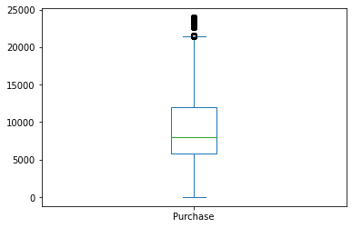
    


Leczenie wartości odstających nie polega na ich usuwaniu, ale przycięciu do wcześniej wyliczonych przycięć górnych i dolnych.  
Przycinanie wszystkichwartości większych niż górne odcięcie do górnego odcięcia.


```python
df.Purchase.clip(upper=uc, inplace=True)
```


```python
df.Purchase.plot(kind='box')
```


    <AxesSubplot:>


    
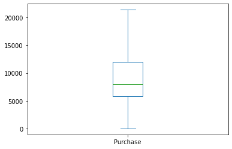
    


### 4. Analiza jednowymiarowa.

W tego typu analizie używamy **pojedynczej zmiennej i kreślimy na niej wykresy**. Tutaj wykresy są tworzone po to, aby zbadać rozkład i skład danych w zależności od typu zmiennej - kategorycznej lub numerycznej.  

**Dla zmiennych ciągłych**: aby zobaczyć rozkład danych, tworzymy wykresy pudełkowe i histogramy.


```python
# histogram dla zmiennej Purchase
df.Purchase.hist()
```


    <AxesSubplot:>


    
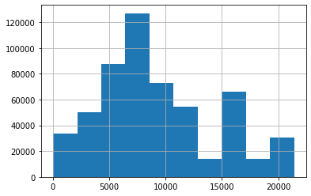
    


```python
# lub z użyciem bardziej ogólnej metody plot()
df.Purchase.plot(kind='hist', grid=True)
```


    <AxesSubplot:ylabel='Frequency'>


    
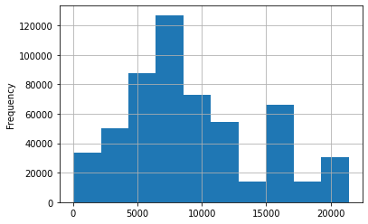
    


```python
# lub z bezpośrednim użyciem pakietu matplotlib
plt.hist(df.Purchase)
plt.grid(True)
# jeżeli nie korzystamy z trybu liniowego (ang. inline)
# plt.show()
```


    

    


```python
# i dla wykresu pudełkowego
plt.boxplot(df.Purchase)
```


    {'whiskers': [<matplotlib.lines.Line2D at 0x1d446965fd0>,
      <matplotlib.lines.Line2D at 0x1d4469752e0>],
     'caps': [<matplotlib.lines.Line2D at 0x1d4469755b0>,
      <matplotlib.lines.Line2D at 0x1d446975880>],
     'boxes': [<matplotlib.lines.Line2D at 0x1d446965d00>],
     'medians': [<matplotlib.lines.Line2D at 0x1d446975b50>],
     'fliers': [<matplotlib.lines.Line2D at 0x1d446975e20>],
     'means': []}


    
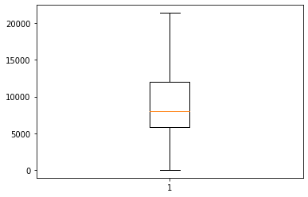
    


**Dla zmiennych kategorycznych**

Aby zobaczyć rozkład danych, tworzymy wykresy częstotliwości, takie jak wykresy słupkowe, poziome wykresy słupkowe itp.
Aby zobaczyć skład danych tworzymy wykresy kołowe.


```python
df.groupby('Gender').City_Category.count().plot(kind='pie')
```


    <AxesSubplot:ylabel='City_Category'>


    
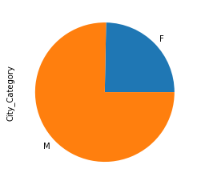
    


```python
# tym razem seaborn
sns.countplot(x='Marital_Status', data = df)
# lub starym sposobem (niezalecane)
# sns.countplot(df.Marital_Status)
```


    <AxesSubplot:xlabel='Marital_Status', ylabel='count'>


    
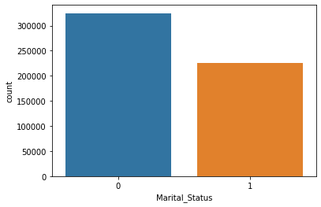
    


```python
# skład danych kategoria miasta
df.groupby('City_Category').City_Category.count().plot(kind='pie')
```


    <AxesSubplot:ylabel='City_Category'>


    
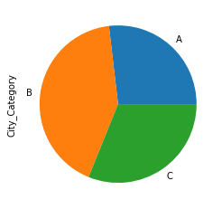
    


```python
# rozkład wieku
sns.countplot(x='Age', data = df)
```


    <AxesSubplot:xlabel='Age', ylabel='count'>


    
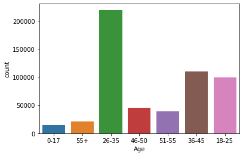
    


```python
# dystrybucja kategorii produktu 1
df.groupby('Product_Category_1').City_Category.count().plot(kind='barh')
```


    <AxesSubplot:ylabel='Product_Category_1'>


    
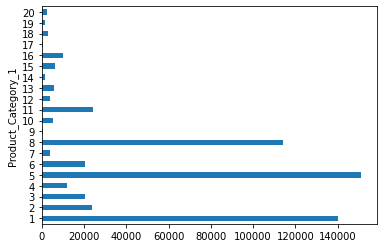
    


### 5. Analiza dwuwymiarowa

W tego typu analizie bierzemy dwie zmienne na raz i tworzymy na nich wykresy. Ponieważ mamy 2 typy
zmiennych, kategoryczne i numeryczne, więc mogą istnieć 3 przypadki w analizie dwuwymiarowej.  

#### 5.1 Numeryczne i numeryczne

Aby zobaczyć związek między 2 zmiennymi, tworzymy wykresy punktowe i
macierz korelacji z mapą cieplną na górze.

**Wykres punktowy**  
Ponieważ w naszym zestawie danych znajduje się tylko 1 zmienna ciągła, nie możemy tutaj utworzyć
wykresu punktowego. Ale jak możemy to zrobić? Weźmy hipotetyczny przykład taki, że uważamy
wszystkie zmienne liczbowe (mające `dtype` jako `int` lub `float` ) tutaj za zmienne liczbowe.


```python
df.plot(x='Product_Category_1',y='Product_Category_2', kind='scatter')
```


    <AxesSubplot:xlabel='Product_Category_1', ylabel='Product_Category_2'>


    
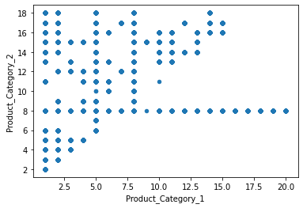
    


**Macierz korelacji**


```python
# Znalezienie korelacji między wszystkimi zmiennymi liczbowymi.
df.select_dtypes(['int64','float64']).corr()
```


<div>
<style scoped>
    .dataframe tbody tr th:only-of-type {
        vertical-align: middle;
    }

    .dataframe tbody tr th {
        vertical-align: top;
    }

    .dataframe thead th {
        text-align: right;
    }
</style>
<table border="1" class="dataframe">
  <thead>
    <tr style="text-align: right;">
      <th></th>
      <th>User_ID</th>
      <th>Occupation</th>
      <th>Marital_Status</th>
      <th>Product_Category_1</th>
      <th>Product_Category_2</th>
      <th>Purchase</th>
    </tr>
  </thead>
  <tbody>
    <tr>
      <th>User_ID</th>
      <td>1.000000</td>
      <td>-0.023971</td>
      <td>0.020443</td>
      <td>0.003825</td>
      <td>0.002065</td>
      <td>0.004608</td>
    </tr>
    <tr>
      <th>Occupation</th>
      <td>-0.023971</td>
      <td>1.000000</td>
      <td>0.024280</td>
      <td>-0.007618</td>
      <td>0.001566</td>
      <td>0.020853</td>
    </tr>
    <tr>
      <th>Marital_Status</th>
      <td>0.020443</td>
      <td>0.024280</td>
      <td>1.000000</td>
      <td>0.019888</td>
      <td>0.010260</td>
      <td>-0.000599</td>
    </tr>
    <tr>
      <th>Product_Category_1</th>
      <td>0.003825</td>
      <td>-0.007618</td>
      <td>0.019888</td>
      <td>1.000000</td>
      <td>0.279247</td>
      <td>-0.347413</td>
    </tr>
    <tr>
      <th>Product_Category_2</th>
      <td>0.002065</td>
      <td>0.001566</td>
      <td>0.010260</td>
      <td>0.279247</td>
      <td>1.000000</td>
      <td>-0.131104</td>
    </tr>
    <tr>
      <th>Purchase</th>
      <td>0.004608</td>
      <td>0.020853</td>
      <td>-0.000599</td>
      <td>-0.347413</td>
      <td>-0.131104</td>
      <td>1.000000</td>
    </tr>
  </tbody>
</table>
</div>


```python
# i umieszczenie na odpowiednim wykresie
sns.heatmap(df.select_dtypes(['int64','float64']).corr(), annot=True)
```


    <AxesSubplot:>


    
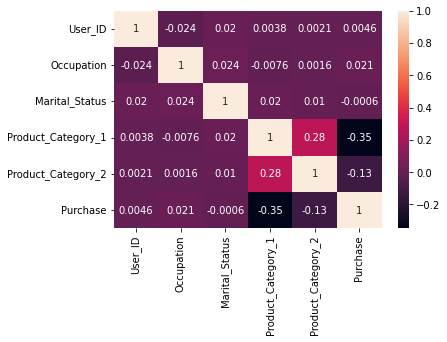
    


#### 5.2 Numeryczne i kategoryczne.

Aby zobaczyć skład danych tworzymy wykresy słupkowe i liniowe.  
Aby zobaczyć porównanie 2 zmiennych, tworzymy wykresy słupkowe i liniowe.  
Porównanie `Purchase` i `Occupation` na wykresie słupkowym.


```python
df.groupby('Occupation').Purchase.sum().plot(kind='bar')
```


    <AxesSubplot:xlabel='Occupation'>


    
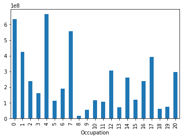
    


```python
summary=df.groupby('Occupation').Purchase.sum()
plt.title('Occupation vs. Purchase')
plt.bar(x=summary.index , height=summary.values)
```


    <BarContainer object of 21 artists>


    
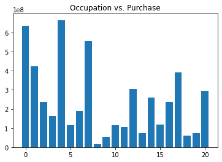
    


```python
# i seaborn TODO: do poprawy
sns.barplot(summary.index , summary.values)
```

    C:\Users\kaszp\__projects\__wd_su_2022\venv\lib\site-packages\seaborn\_decorators.py:36: FutureWarning: Pass the following variables as keyword args: x, y. From version 0.12, the only valid positional argument will be `data`, and passing other arguments without an explicit keyword will result in an error or misinterpretation.
      warnings.warn(
    


    <AxesSubplot:xlabel='Occupation'>


    
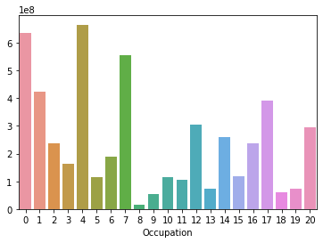
    


```python
# wykres liniowy (trend) dla porównania wieku i zakupów
df.groupby('Age').Purchase.sum().plot(kind='line')
```


    <AxesSubplot:xlabel='Age'>


    
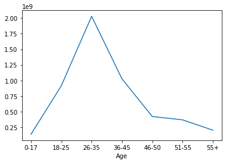
    


```python
# skład zakupów w zależności od płci
df.groupby('Gender').Purchase.sum().plot(kind='pie')
```


    <AxesSubplot:ylabel='Purchase'>


    
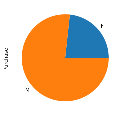
    


```python
# porównanie zakupów i kategorii miasta - wykres warstwowy
df.groupby('City_Category').Purchase.sum().plot(kind='area')
```


    <AxesSubplot:xlabel='City_Category'>


    
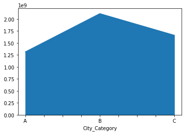
    


```python
# Porównanie zakupu i Stay_In_Current_City_Years : poziomy wykres słupkowy
df.groupby('Stay_In_Current_City_Years').Purchase.sum ().plot(kind='barh')
```


    <AxesSubplot:ylabel='Stay_In_Current_City_Years'>


    
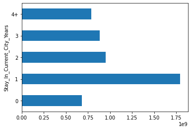
    


```python
# porównanie zakupoów i stanu cywilnego
sns.boxplot(x='Marital_Status', y='Purchase',data=df)
```


    <AxesSubplot:xlabel='Marital_Status', ylabel='Purchase'>


    
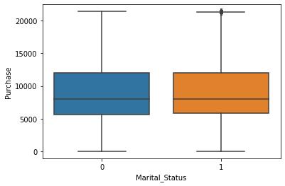
    


#### 5.3 Kategoryczne i kategoryczne

Aby zobaczyć związek między 2 zmiennymi, tworzymy tabelę przestawną i mapę cieplną.


```python
# tworzenie tabeli przestawnej między wiekiem a płcią
pd.crosstab(df.Age,df.Gender)
```


<div>
<style scoped>
    .dataframe tbody tr th:only-of-type {
        vertical-align: middle;
    }

    .dataframe tbody tr th {
        vertical-align: top;
    }

    .dataframe thead th {
        text-align: right;
    }
</style>
<table border="1" class="dataframe">
  <thead>
    <tr style="text-align: right;">
      <th>Gender</th>
      <th>F</th>
      <th>M</th>
    </tr>
    <tr>
      <th>Age</th>
      <th></th>
      <th></th>
    </tr>
  </thead>
  <tbody>
    <tr>
      <th>0-17</th>
      <td>5083</td>
      <td>10019</td>
    </tr>
    <tr>
      <th>18-25</th>
      <td>24628</td>
      <td>75032</td>
    </tr>
    <tr>
      <th>26-35</th>
      <td>50752</td>
      <td>168835</td>
    </tr>
    <tr>
      <th>36-45</th>
      <td>27170</td>
      <td>82843</td>
    </tr>
    <tr>
      <th>46-50</th>
      <td>13199</td>
      <td>32502</td>
    </tr>
    <tr>
      <th>51-55</th>
      <td>9894</td>
      <td>28607</td>
    </tr>
    <tr>
      <th>55+</th>
      <td>5083</td>
      <td>16421</td>
    </tr>
  </tbody>
</table>
</div>


```python
# mapa cieplna
sns.heatmap(pd.crosstab(df.Age,df.Gender))
```


    <AxesSubplot:xlabel='Gender', ylabel='Age'>


    
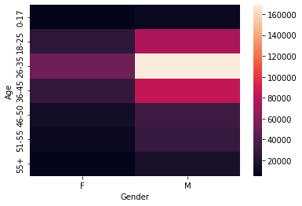
    


```python
# związek między City_Category a Stay_In_Current_City_Years
sns.heatmap(pd.crosstab(df.City_Category,df.Stay_In_Current_City_Years))
```


    <AxesSubplot:xlabel='Stay_In_Current_City_Years', ylabel='City_Category'>


    
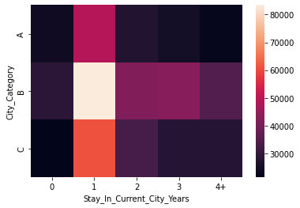
    

